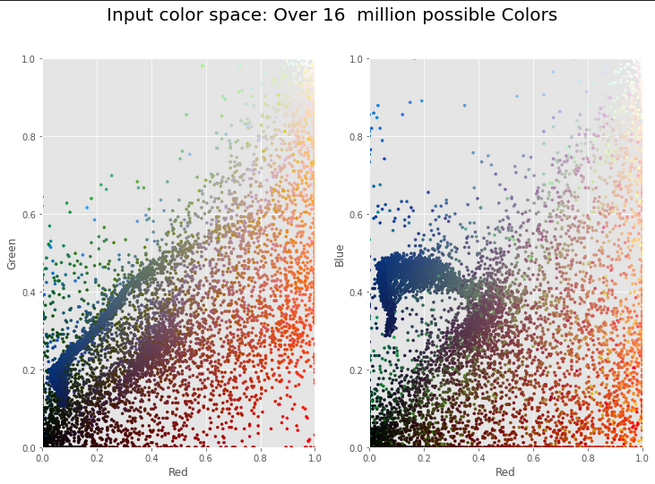
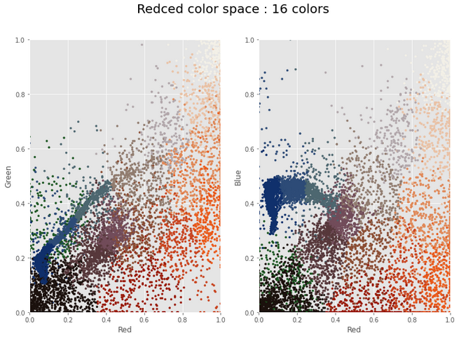
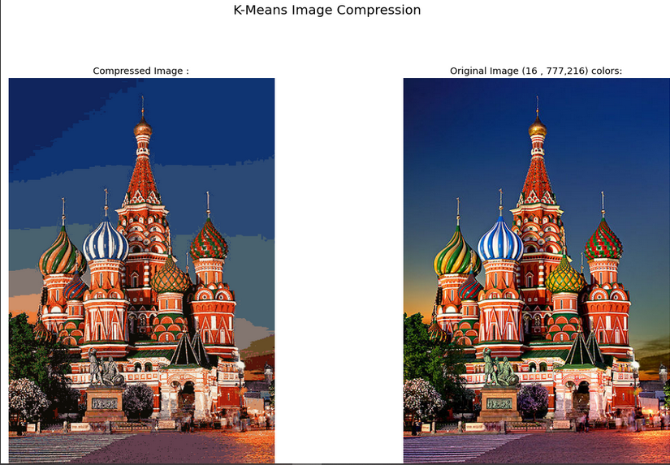

# Image-Compression-using-K-Means

### Project Description:

In this project, I have demonstrated compressing an image using the K means algorithm. It is an unsupervised algorithm that is used to sperate unlabelled data. The interactive control allows us to select an image and then set the k value using a slider.

### Software and Libraries:

    1.NumPy
    2.matplotlib
    3.skimage 
    4.sklearn
    5.ipywidgets
    6.Python 3
    

### Images

Below is the sample image out of many images:

 

 
In the above image we observe that there are many colors present and there is smooth transition over image from one color to another.
Using k means we will see that there is lack of diversity in the colors so using k means we will reduce the colors so as to compress the image and then visualize the color space.

 
Now we can see clear transitions from one color to other and also not so rich in colors as there are only 16 colors.

Below is the sample compressed image compared with an original image where K value is set by default as 16:

### Key Points
1. We have pixels as a group in an image by their similar id in color to reduce the total no of colors in that image. So each cluster centroid is representative of a color vector in RGB color space of its respective color.
2. The default k value set in the program is 16 clusters or 16 colors. k means unsupervised algorithm is used to sperate unlabelled data like image colors into distinct groups.    
3. Compression performed will be lossy, so fine details in an image are lost. A higher value of k can be set to minimize the loss.

###Alternative Approaches
1. Reducing frequency of image
2. Reducing intensity ranges of pixels.

    

